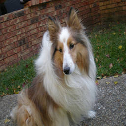
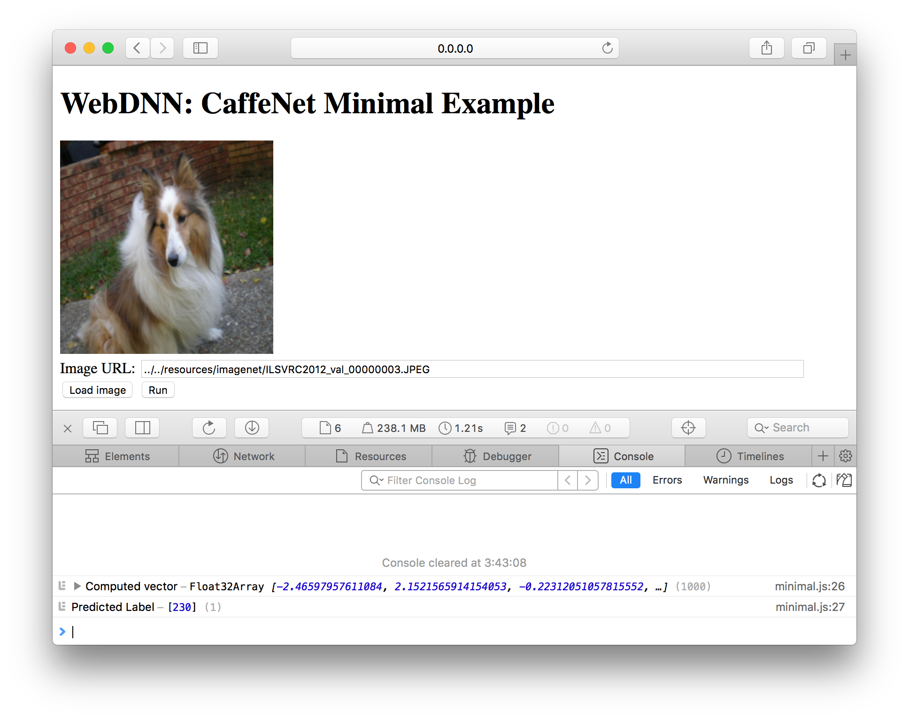

# Use with Caffemodel

In this section, you will learn about how to convert your caffemodel
into `GraphDescriptor`, and run `GraphDescriptor` on your web page.

## 1. Convert Caffemodel into GraphDescriptor

See jupyter notebook ([caffenet_conversion.ipynb](https://github.com/mil-tokyo/mil-web-dnn/blob/master/example/convert_caffe/caffenet_conversion.ipynb)) to see how to convert model offline.

## 2. Run on web browser

In this section, I'll describe how to run generated descriptor on web browser. 
you can view complete codes (HTML and JS file) in `/example/convert_caffe`.

First, You have to initialize [`DescriptorRunner`](../api_reference/descriptor_runner/interfaces/webdnn.dnndescriptorrunner.html) 
and load model data.

```js
let runner = await runner.prepareAll('./output');
```

WebDNN automatically select the best backend based on Browser type and 
compiled model data on the server.

You can check the backend type

```js
console.log(runner.backendName);
```


Then you can get input and output variable references.

```js
let x = runner.inputViews[0];
let y = runner.outputViews[0];
```

That's all for initialization. You only have to do this at once in the application.

Let's classify this image.



First, set input data.

```js
// loadImageData() returns image data as Float32Array
x.set(loadImageData());
```

Next, run model.

```js
await runner.run();
```

That's all.

Show computed vector and predicted label.

```js
console.log('Computed vector', y);
console.log('Predicted Label', WebDNN.Math.argmax(y));
```



Congratulation! `LabelID:230` is `"Shetland sheepdog"` in ImageNet. It looks work well.
